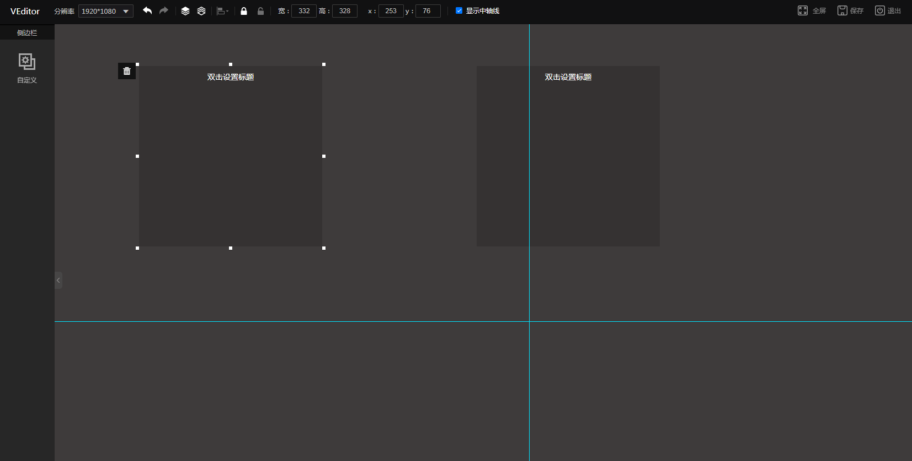

# VEditor

> a content editor based on vue and element ui.
基于vue和element ui的富内容编辑器，类似于PS，提供核心的编辑功能，用户可自行进行功能扩展

<a href="http://47.99.218.109/VEditor/">demo 地址</a>


## feature
* editor can set resolving, fullscreen, save (编辑区可调整分辨率，全屏，保存)
* support history steps (操作步骤支持历史记录)
* support shortcut (支持快捷操作)
* support drag, sizing, position ,settop(元素可进行拖拽，大小，位置，对齐，置顶，等基本属性的设置)
## usage
VEditor provided the core functionality of edit, and you can expand any functions and element based on it

notice: whenever you want a history record ,you need use the history api to record it manually,here`s the example
``` js
 store.history.update()
```
## Build Setup

``` bash
# install dependencies
npm install

# serve with hot reload at localhost:8080
npm run dev

# build for production with minification
npm run build
```
## Author
luoliqiang


